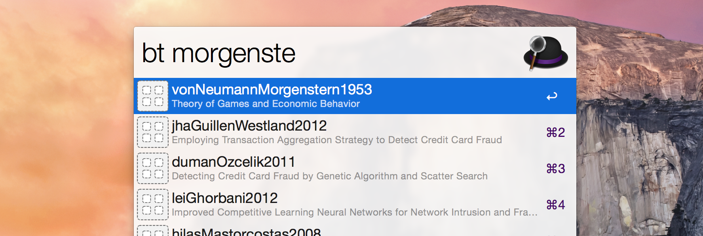

BibTeX Search for Alfred
========================

Download the workflow [here](https://github.com/tknuth/bibtex-search/releases/download/v1.0.0/BibTeX-Search-v1.0.0.alfredworkflow).

To get started, adjust the following command to your needs:

    touch ~/.bibtex_alfred
    echo "path/to/bibliography1" >> ~/.bibtex_alfred
    echo "path/to/bibliography2" >> ~/.bibtex_alfred
    echo "path/to/bibliography3" >> ~/.bibtex_alfred

